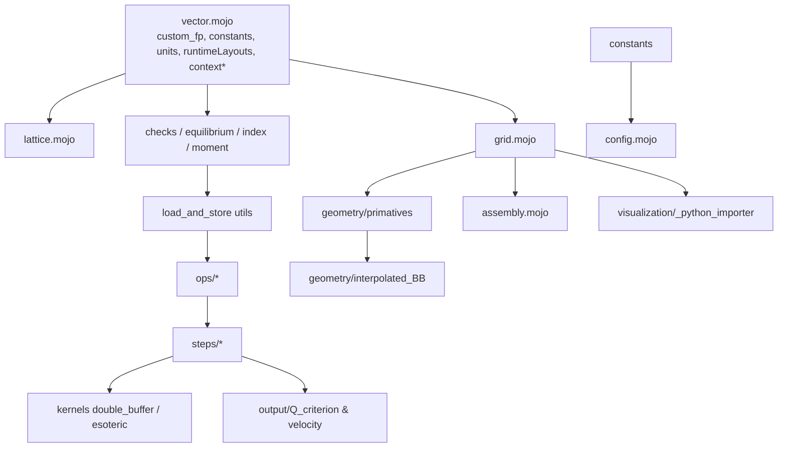

# Mojo 1.0.0 Stable Transition Plan

> **Scope:** Fix `pixi run precompile_test` (`mojo precompile src -o src.mojoc --disable-warnings`) errors only. Ignore warnings. Work bottom-up, reducing error count in small batches, not one-shot.
> **Current state:** 331 errors across ~55 files, 2111 total diagnostic lines. Generated from `mojo >=1.0.0,<2` + `max >=26.5,<27`.

---

## 1. Error taxonomy (from `precompile_test` logs)

Derived from `pixi run precompile_test 2>&1 | grep -oP "error: \K.*"` (`sort | uniq -c`).

| # | Bucket | Count | Example message | Root cause (1.0 breaking change) | Affected files (examples) |
|---|--------|-------|----------------|----------------------------------|---------------------------|
| A | `coord` → `dyn_coord` + `parameter values: Int vs DType` | 63 | `parameter 'values' has 'Int' type, but value has type 'DType'` `src/utils/runtimeLayouts.mojo:11:63` `row_major(coord[DType.int32]((3,)))` | `layout.coord` is now `coord: def[*Ts: CoordLike] -> Coord[*Ts]` where `Coord` expects `Int`-like, `dyn_coord` must be used for dtype-param layouts; import changed to `from std.utils.coord import dyn_coord` (see `transition.md:18-21`) | `src/utils/runtimeLayouts.mojo:11,22,34,45` `src/utils/contextCSR.mojo:28` `src/lbm/geometry/primatives.mojo:83,92,161,243` `src/lbm/geometry/rigidSphere.mojo:96,106` `src/lbm/kernels/double_buffer.mojo:82` `src/lbm/kernels/esoteric_pull.mojo:97` `src/lbm/output/Q_criterion.mojo:179` etc. (63 total, see `pixi run precompile_test \| grep "parameter 'values'"`) |
| B | `cannot materialize comptime value … not ImplicitlyCopyable` | ~76 | `cannot materialize comptime value of type 'Array[Int, Int(3)]' to runtime … note: use 'materialize'` `src/visualization/_python_importer.mojo:61:32` | `Array` (formerly `InlineArray`) is no longer `ImplicitlyCopyable` in 1.0; comptime arrays must be `materialize[expr]()` before runtime use, or made runtime args. `transition.md:23-36` says replace `comptime directions = lattice.directions` with `directions = materialize[lattice.directions]()` and migrate param→arg for functions taking arrays | `src/visualization/_python_importer.mojo:57,61` (6 errs) `src/lbm/geometry/primatives.mojo:65,81,96,97,143,157-159,224` (22 errs) `src/lbm/kernels/*` etc. |
| C | `value of type Array[…] cannot be implicitly copied` | 32 | `value of type 'Array[Int, Int(3)]' cannot be implicitly copied … note: consider transferring … ^ … .copy()` `src/lbm/geometry/interpolated_BB.mojo:43:12` | Same `Array` copy-semantics change; leaf `InlineArray`/`Array` now needs explicit `.copy()` or `^` transfer | `src/lbm/geometry/interpolated_BB.mojo:43` `nodewise_interpolated_BB.mojo:43` `src/lbm/geometry/rigidstationary.mojo:169` `src/lbm/kernels/utils/moment` callers etc. |
| D | Moved GPU stdlib symbols | 27 | `package 'gpu' does not contain 'HostBuffer'` `src/utils/contextTileTensor.mojo:8:21` `package 'gpu' does not contain 'barrier'` `src/lbm/geometry/interpolated_BB.mojo:6:61` | `HostBuffer`/`DeviceBuffer` moved from `std.gpu` → `max.gpu.host` (`DeviceContext`, `DeviceBuffer`); `barrier` moved `std.gpu` → `max.gpu.sync` or `std.gpu.sync`. See `mojo-gpu-fundamentals` skill imports table | `src/utils/contextTileTensor.mojo:8` `src/utils/contextCSR.mojo:9` `src/lbm/geometry/interpolated_BB.mojo:6` `src/lbm/geometry/nodewise_interpolated_BB.mojo:6` plus 23 `barrier` errs in archives |
| E | Benchmark `iter_custom` API break | 21 | `no matching method in call to 'iter_custom' b.iter_custom[run_kernel](ctx)` `src/lbm/archive/base/benchmark.mojo:70:6` `note: candidate 'iter_custom' parameter 'FuncType' has 'def(Int)->Int'` | `Bencher.iter_custom` no longer takes `DeviceContext`; GPU form is free fn `bencher_iter_custom(b, launch, ctx)` from `max.benchmark`. Closure must be unified `{imm}`/`{mut,…}` not `@__parameter` `capturing[_]`. See `mojo-gpu-fundamentals:584` + `closure_migration` skill | `src/lbm/kernels/benchmark/double_buffer.mojo:130` `esoteric.mojo:129` `src/lbm/archive/*/benchmark.mojo` (21 total) |
| F | `Int` vs `Int32` adjacency | 12 | `invalid call to '__mul__': … cannot be converted from 'Int' to 'Int32'` `src/lbm/kernels/utils/moment.mojo:183` and `get_adjacent_idx` implicit conversion | `transition.md:15` says replace `Int(...)` with `Int32(...)` in archive `get_adjacent_idx`; `moment.mojo:183` stray `[` indicates param parsing now stricter | `src/lbm/archive/*/LBM_gpu_kernel.mojo` (adjacency) `src/lbm/kernels/utils/moment.mojo:183` |
| G | `InlineArray`/`Array` literal init | 5 | `no matching function in initialization stress_indices: InlineArray[InlineArray[int_scalar,2],n] = [[0,0]]` `src/lbm/lattice.mojo:374:70` | `Array` literal init now requires explicit `__list_literal__` or `fill=`; type alias `InlineArray` may have been replaced by `Array`; `n` comptime param mismatch | `src/lbm/lattice.mojo:374,377,384` (3 errs) + 2 similar in other files |
| H | Unknown declarations (import break) | 12 | `use of unknown declaration 'LBM_Config'` `src/lbm/preprocess/boundary_condition.mojo:85:28` `use of unknown declaration 'GridLike'` `src/lbm/kernels/steps/load_f.mojo:15:15` | `LBM_Config`/`GridLike`/`Flags`/`cs_squared`/`SOLID_NODE` missing due to circular or removed re-exports after 1.0; `src/lbm/__init__.mojo` may not re-export correctly; `mojo-syntax` requires `from std.*` prefixes but internal `src.*` packages now stricter | `src/lbm/preprocess/boundary_condition.mojo:85,193` `initial_condition.mojo:53,92` `src/lbm/kernels/steps/load_f.mojo:15` `rigidstationary.mojo` etc. |
| I | Stray `[` param list | 1 | `parameter list may not appear at the start of the line [` `src/lbm/kernels/utils/moment.mojo:183:5` | Parser now rejects legacy `fn`/`alias` syntax; verify file still uses `def` only (mojo-syntax:84 `fn` removed) |
| J | Copy-ctor synthesis failure | 3 | `cannot synthesize implicit copy constructor because field 'origin' has non-implicitly-copyable type 'Array[…]'` `src/lbm/grid.mojo` | Struct `LBM_Grid` holds `origin: Array[Scalar[float_dtype],3]` but no longer `ImplicitlyCopyable`; struct itself claimed `ImplicitlyCopyable` or holds non-copyable field |
| K | Missing `moment` symbol | 3 | `module 'moment' does not contain 'get_strain_rate_tensor_norm_squared'` | API renamed/removed in `moment.mojo` vs `turbulence.mojo` |
| L | `TileTensor` origin/type mismatches | ~8 | `invalid call to 'get_velocity_gradient': value passed to 'shared_u' cannot be converted from 'TileTensor[float_dtype,…]' to 'TileTensor[DType.int,…]'` `src/lbm/output/Q_criterion` etc. | Generic param `MutAnyOrigin` vs `ImmUntrackedOrigin` now stricter; need correct `origin` or `mut` capture (see `mojo-gpu-fundamentals` TileTensor section) |

Remaining ~30 errs are follow-ons of A–C (e.g. `coord` inside `flags.store` cascading to load/store errors).

---

## 2. Dependency tree (non-archive, `src/` only)

Bottom-up order: Tier 0 leaves → Tier 4 roots. Fix leaves first so downstream errors are not phantom. Archive (`src/lbm/archive/*`: 56 files) is **deprioritized** — treat as Tier 5, fix after core is green or keep excluded from `precompile_test` via shim.

```
Tier 0 — Leaves (no src deps, only stdlib / max / python)
  src/utils/vector.mojo                          [ImplicitlyCopyable, uses InlineArray; no src import]
  src/utils/custom_fp.mojo                       [bitcast, no src import]
  src/lbm/constants.mojo                         [Set, comptime only]
  src/lbm/units.mojo
  src/lbm/runtimeParams.mojo
  src/lbm/layoutstruct.mojo
  src/utils/runtimeLayouts.mojo                  [layout.row_major, coord] ← BUG A
  src/utils/contextTileTensor.mojo               [std.gpu.HostBuffer] ← BUG D
  src/utils/contextCSR.mojo                      [std.gpu.HostBuffer] ← BUG D
  src/lbm/kernels/utils/finite_difference.mojo   [no src dep, but uses coord]
  src/lbm/kernels/utils/shared_tile.mojo
  src/utils/__init__.mojo (re-exports Vector, ContextTileTensor — must stay green)
  src/lbm/*/__init__.mojo stubs

Tier 1 — Depends only on Tier 0
  src/lbm/lattice.mojo                ← Vector                 [BUG G]
  src/lbm/config.mojo                 ← custom_fp, constants   [BUG B: materialize Flags set]
  src/lbm/kernels/utils/checks.mojo   ← Vector
  src/lbm/kernels/utils/equilibrium.mojo ← Vector
  src/lbm/kernels/utils/index.mojo    ← Vector                 [BUG F: get_adjacent_idx Int32]
  src/lbm/kernels/utils/moment.mojo   ← Vector, cs_squared     [BUG F: stray '[', Int32]

Tier 2
  src/lbm/grid.mojo                   ← Vector, TiledLayouts, GridLike trait [BUG J, B]
  src/lbm/geometry/primatives.mojo    ← LBM_Grid, Lattice, Flags, index [BUG A,B,C]
  src/lbm/geometry/rigidSphere.mojo   ← LBM_Grid, index      [BUG A]
  src/lbm/geometry/rigidstationary.mojo ← LBM_Grid, runtimeLayouts [BUG C,J]
  src/lbm/kernels/utils/load_and_store.mojo ← LBM_Grid, Vector, Float16C [A,B]
  src/lbm/kernels/ops/collisions/KBC_.mojo ← equilibrium, Vector
  src/lbm/kernels/ops/collisions/collision.mojo ← equilibrium, checks
  src/lbm/kernels/ops/turbulence.mojo ← moment   [BUG K]
  src/lbm/kernels/steps/apply_boundary_condition.mojo ← LBM_Config, index, ops
  src/lbm/output/Q_criterion.mojo     ← Grid, moment, finite_difference, shared_tile [A,L]
  src/lbm/output/velocity.mojo         (similar)
  src/lbm/preprocess/boundary_condition.mojo ← GridLike [BUG H]
  src/lbm/outputrequest.mojo          ← constants, TiledLayouts, kernels
  src/lbm/solver.mojo                 ← constants, TiledLayouts, kernels
  src/lbm/assembly.mojo               ← constants, kernels, preprocess, GridLike/ConfigLike [H]
  src/visualization/_python_importer.mojo ← LBM_Grid [BUG B]

Tier 3
  src/lbm/geometry/interpolated_BB.mojo      ← index, load_and_store, Grid, moment, runtimeLayouts [D,C]
  src/lbm/geometry/nodewise_interpolated_BB.mojo (same + steps)
  src/lbm/kernels/double_buffer.mojo         ← Grid, checks, load_and_store, steps [A,H]
  src/lbm/kernels/esoteric_pull.mojo          (same)
  src/lbm/kernels/ops/boundary_condition.mojo ← index, load_and_store, equilibrium [A]
  src/lbm/kernels/ops/load_and_store.mojo     ← Grid, index, load_and_store, Float16C [A]
  src/lbm/kernels/steps/collide.mojo          ← index, load_and_store, moment, equilibrium, turbulence, ops [A,B]
  src/lbm/output/drag.mojo                    ← index, load_and_store, Grid, runtimeLayouts [A]

Tier 4 — Roots (depend on Tier 3)
  src/lbm/kernels/steps/load_f.mojo   ← ops.load_and_store [H: GridLike trait]
  src/lbm/kernels/steps/store_f.mojo  ← index, ops.load_and_store, Float16C
  src/lbm/kernels/steps/stream.mojo   ← index, ops.load_and_store
  src/lbm/preprocess/initial_condition.mojo ← GridLike, equilibrium, load_and_store [H, A, B]
  src/lbm/kernels/benchmark/* (3 files) ← Grid, preprocess, kernels [BUG E]

Tier 5 — Archive (56 files, low priority, all depend on Tier 0-2)
  src/lbm/archive/base/*, part_1/*, part_2/*, part_3/*
  → Fix Int→Int32 (F), barrier (D), bench (E), template errors later; optionally exclude from precompile.
```

Mermaid view (copy to `mermaid` renderer):



---

## 3. Fix plan — Phases (dependency-ordered, error-bucket-ordered)

**General rules:** Follow `mojo-syntax` + `mojo-gpu-fundamentals` + `closure_migration`. Never add `@__parameter`/`@parameter` on nested closures; use unified `def … {imm}` / `{mut …, imm}` / `{var …}`. Use `materialize[expr]()` for `Array` comptime values. Run `pixi run precompile_test` after each phase; target is strictly decreasing error count. Ignore warnings (`--disable-warnings`).

### Phase 0 — Scaffolding & triage (no code change, this document)

- [x] Capture full `precompile_test` log (`pixi run precompile_test 2>&1 | tee /tmp/precompile.log`).
- [x] Bucket errors (table §1).
- [x] Build dependency tiers (§2) via import scan.
- [x] Create `transition_plan.md` (this file) and a tracking `transition_errors.md` with per-file error counts (`pixi run precompile_test 2>&1 | grep "error:" | sed 's/:.*//' | sort | uniq -c | sort -rn > /tmp/counts.txt`).
- Decision: **Defer `src/lbm/archive/`** until core is green. Option: move it out of `src` or gate with `comptime if False` if it blocks CI. Keep it in error counts but assign low priority.

### Phase 1 — Tier 0 leaves (`src/utils/*`, `src/lbm/constants.mojo`, `src/lbm/units.mojo` etc.) — estimated -90 errors

**Goal:** Make leaves precompile, so downstream `Array`/`coord` fixes are not blocked by leaf parse errors.

1. **`src/utils/vector.mojo:9`** — `from layout import TileTensor,LayoutTensor,coord,CoordLike,Coord` is stale. In 1.0 `layout` package still provides `TileTensor`/`LayoutTensor` but `coord` → `dyn_coord`. Change to `from std.utils.coord import dyn_coord` or `from layout import TileTensor,LayoutTensor` + `from std.utils.coord import dyn_coord, Coord, CoordLike`. Verify `Vector.__init__[*Ts: CoordLike](coord: Coord[*Ts])` still valid or needs `dyn_coord` overload. Test: `mojo precompile src/utils/vector.mojo -o /tmp/v.mojoc --disable-warnings`.
2. **`src/utils/runtimeLayouts.mojo:11,22,34,45` + `src/utils/contextCSR.mojo:28`** — Bucket A. Replace `coord[DType.int32]((3,))` → `dyn_coord[DType.int32]((3,))` and `row_major(coord …)` → `row_major(dyn_coord …)`. For runtime helpers `col_major1D(n:Int)` etc., ensure return type uses `type_of(col_major(dyn_coord[DType.int32]((n,))))`. Add `from std.utils.coord import dyn_coord` + `from layout import row_major, col_major`. Count: 5 errs.
3. **`src/utils/contextTileTensor.mojo:8` + `src/utils/contextCSR.mojo:9`** — Bucket D. Change `from std.gpu import HostBuffer, DeviceBuffer` → `from max.gpu.host import DeviceContext, DeviceBuffer` and `from std.gpu import …` → `from max.gpu.host` (host buffers) per `mojo-gpu-fundamentals:Imports`. `HostBuffer` is now `DeviceBuffer` with host allocation via `ctx.enqueue_create_host_buffer`. Check `contextTileTensor` impl for `map_to_host` usage.
4. **`src/lbm/constants.mojo`** — No error, but verify `Set` import: `from std.collections import Set` is fine (per `mojo-syntax` `std.` prefix). Keep as reference.
5. **`src/utils/custom_fp.mojo`** — No error; verify `bitcast` import still `from std.memory import bitcast`.
6. **Mini-verify:** `mojo precompile src/utils -o /tmp/utils.mojoc` should be 0 errors after 1-3.

### Phase 2 — Tier 1 core (`lattice`, `index`, `moment`, `config`, `checks`, `equilibrium`) — estimated -60 errors

1. **`src/lbm/lattice.mojo:353-398` — Bucket G.** `get_stress_indices[D: Int, dtype: DType]() -> InlineArray[InlineArray[Scalar[dtype],2], (D*(D+1)//2)]` uses `InlineArray` literal `[[0,0]]` which now fails because `Array` length param is checked. Fix: replace `InlineArray` with `Array` (new name) or keep `InlineArray` but use explicit init `Array[Array[Scalar[dtype],2], n](unsafe_assume_initialized=…)` then fill, or use list-literal with correct type: `var out = Array[Array[Scalar[dtype],2], n](uninitialized=True); out[0]=[0,0]; …` . Also rename `comptime n = (D*(D+1))//2` and ensure `n` is used as literal. Check `src/utils/vector.mojo:35` similar `InlineArray` usage. Follow `mojo-syntax: InlinedFixedVector[T,N] → Array[T,N]`.
2. **`src/lbm/kernels/utils/index.mojo` — Bucket F.** `get_adjacent_idx` implicit `Int`→`Int32` conversion — change all `Int(...)` wraps to `Int32(...)` per `transition.md:15`. Grep `get_adjacent_idx` in archives and utils; fix leaf first. Also fix `is_index_valid` similar.
3. **`src/lbm/kernels/utils/moment.mojo:183` — Buckets F+I.** Line `    [` stray bracket: investigate `moment.mojo:180-190` — likely a leftover parametric list `def foo[…](` that now must be `def foo[ … ](` attached to def. Use `mojo-syntax` `def` only. Also fix `__mul__ Int→Int32` lines (6 errs) by wrapping constants with `Int32(...)` or using literal `0` (polymorphic).
4. **`src/lbm/config.mojo:144,160`** — Bucket B. `materialize[_FlagSet]()` and `materialize[Collisions.that_need_fneq]()` already correct; verify they are runtime `materialize` not comptime `alias`. No change if precompile passes.
5. **Verify:** `pixi run precompile_test 2>&1 | grep -c "error:"` should drop ~60.

### Phase 3 — Tier 2 mid (`grid`, `geometry/primatives`, `load_and_store` utils, `turbulence`, `Q/velocity`, `preprocess/boundary_condition`)

1. **`src/lbm/grid.mojo` — Buckets J+B.** Fields `origin: InlineArray[Scalar[float_dtype],3]` and `shape: InlineArray[Int,3] = [nx,ny,nz]` now non-`ImplicitlyCopyable`. Options: make `LBM_Grid` not `ImplicitlyCopyable` (remove trait), or change field type to `Array` + add explicit `__init__(out self, *, copy: Self)` if needed, or store as `Tuple`. Minimal fix: change `InlineArray` → `Array` and add `var origin: Array[Scalar[Self.float_dtype],3]` plus handle `__init__` assignments via `.copy()` or `^`. Also fix `get_grid_coordinates` return `Array[…]` needs `^`/`.copy()` or `materialize`.
2. **`src/lbm/geometry/primatives.mojo:65ff` — Buckets A,B,C.** 22 errs. For each `grid.origin[i]`/`grid.shape[i]`/`grid.dx` inside Python-like loops, wrap `materialize[grid.origin]()` or capture `var origin = materialize[grid.origin]()` at function start per `transition.md:32-33`. Replace all `coord[DType.int32]((nx,ny,nz))` → `dyn_coord[DType.int32]((nx,ny,nz))` and `from std.utils.coord import dyn_coord`. Also fix `latticeModel.directions[q][i]` which now needs `materialize[lattice.directions]()[q][i]` or `var dirs = materialize[lattice.directions](); dirs[q][i]`.
3. **`src/lbm/kernels/utils/load_and_store.mojo:10ff` — Bucket A.** Fix all `coord[DType.uint32]((…))` stores/loads to `dyn_coord`.
4. **`src/lbm/kernels/ops/turbulence.mojo` + `src/lbm/kernels/utils/moment.mojo` — Bucket K.** Verify `get_strain_rate_tensor_norm_squared` exists; if removed, import from `turbulence` or inline. Check `moment.mojo` exports.
5. **`src/lbm/preprocess/boundary_condition.mojo:85,193` — Bucket H.** Add missing imports: `from src.lbm.config import LBM_Config` and `from src.lbm.grid import GridLike, LBM_Grid`. In 1.0 `src/lbm/__init__.mojo` re-exports may be incomplete — add explicit import. Similarly `initial_condition` will be Phase 4 but prep here.
6. **`src/visualization/_python_importer.mojo:57,61` — Bucket B.** `grid.origin[i]`/`grid.shape[i]` indexing inside `Python.tuple(…)` needs `materialize`. Example fix: `var origin = materialize[grid.origin](); Python.tuple(origin[0], …)` or per-element `materialize[grid.origin]()[0]`. Similarly for `grid.shape`.
7. **Verify per-file:** `mojo precompile src/lbm/geometry/primatives.mojo` then full `precompile_test` count.

### Phase 4 — Tier 3-4 roots (`geometry/interpolated_BB`, `kernels/*`, `steps/*`, `preprocess/initial_condition`, `benchmark`)

1. **Bucket D — Barrier.** `src/lbm/geometry/interpolated_BB.mojo:6` and `nodewise_interpolated_BB.mojo:6`: change `from std.gpu import … barrier` → `from max.gpu.sync import barrier` (or `from std.gpu.sync import barrier` — follow `mojo-gpu-fundamentals:42`). Do global `rg 'from std.gpu import.*barrier'`.
2. **Bucket C — Copy semantics.** After B is fixed, each `return index` where `index: Array[Int,3]` needs `return index^` or `return index.copy()`. Search `rg 'return index'` and `rg 'cannot be implicitly copied'`. Apply consistently with `mojo-syntax:Explicit copy / transfer`.
3. **Bucket A — Remaining coord.** Grep `coord\[DType` (63 occurrences). Bulk replace `coord[` → `dyn_coord[` after adding `from std.utils.coord import dyn_coord` to each file. Do per-tier to avoid breaking leaf fixes.
4. **Tier 3 kernels:** `src/lbm/kernels/double_buffer.mojo:82`, `esoteric_pull.mojo:97`, `ops/boundary_condition.mojo:129,130`, `ops/load_and_store.mojo:291`, `steps/collide.mojo`, `output/drag.mojo:…` — same `coord`→`dyn_coord` + fix `Flags`/`SOLID_NODE` imports (`from src.lbm.constants import Flags, SOLID_NODE` missing in `esoteric_pull.mojo:18`).
5. **Tier 4 steps:** `src/lbm/kernels/steps/load_f.mojo:15` — add `from src.lbm.grid import GridLike` (trait import). `store_f.mojo`, `stream.mojo` — verify `GridLike` import. `preprocess/initial_condition.mojo:53,92` — same `LBM_Config`/`GridLike` import fix + `coord` replacement.
6. **Bucket E — Benchmarks.** Migrate all `b.iter_custom[run_kernel](ctx)` to `bencher_iter_custom`. Template:
   ```mojo
   from max.benchmark import bencher_iter_custom
   def bench_fn(mut b: Bencher) raises:
       @always_inline
       def launch(ctx: DeviceContext) raises {imm}:
           ctx.enqueue_function[kernel](args, grid_dim=…, block_dim=…)
       bencher_iter_custom(b, launch, ctx)   # NOT b.iter_custom
   ```
   Remove `@__parameter`/`@parameter` on `run_kernel` closures per `closure_migration:Forbidden`. Files: `src/lbm/kernels/benchmark/double_buffer.mojo:130`, `esoteric.mojo:129`, plus 6 archive benchmarks (`src/lbm/archive/*/benchmark.mojo:70`). Keep capture lists: `{imm}` for read-only, `{mut buf, imm}` if launching.

### Phase 5 — Archive & leftovers (Tier 5) — lowest priority

- `src/lbm/archive/**/*` — 56 files, 90+ errors. Apply same buckets A, D, E, F in bulk, or exclude from `precompile_test` by adding `comptime if False:` gate or moving directory out of `src` (e.g. `archive/`). If keeping, fix `get_adjacent_idx` Int32, `barrier` imports, `iter_custom` benchmarks last.
- Remaining ~15 error types: `cannot synthesize implicit copy constructor` (fix `LBM_Grid`/`Vector` traits), `module 'moment' does not contain …` (re-export), `TileTensor` origin mismatches (check `get_velocity_gradient` signature: `shared_u: TileTensor[float_dtype,…]` not `DType.int` — ensure correct dtype param).
- Run `rg '@__parameter|@parameter' --glob '*.mojo'` → expect 0 in migrated code.

### Phase 6 — Verification & cleanup

- After each phase: `pixi run precompile_test 2>&1 | wc -l` and `grep -c "error:"` — ensure monotonic decrease. Keep `/tmp/precompile.log` diffs.
- Final gate: `pixi run precompile_test` returns 0 errors (warnings ignored via `--disable-warnings`).
- Optional: `mojo build --emit llvm src/lbm/grid.mojo -o /tmp/grid.ll` per `closure_migration:Checklist` to filter metal noise.
- Update `src/lbm/__init__.mojo` re-exports if needed to satisfy downstream `LBM_Config`/`GridLike` unknown-declaration errors.
- Document any intentional behavioral changes vs NFC (allocation sites, `comptime if` arms) in `transition_fixes.log`.

---

## 4. Execution checklist (copy to track progress)

- [ ] Phase 0 done — this plan + `/tmp/counts.txt` baseline (331 errors)
- [ ] Phase 1 — `src/utils/*` leaves green (`mojo precompile src/utils` 0 errs)
- [ ] Phase 2 — `lattice.mojo` + `index.mojo` + `moment.mojo` green
- [ ] Phase 3 — `grid.mojo` + `primatives.mojo` + `visualization/_python_importer.mojo` green
- [ ] Phase 4 — `geometry/*BB.mojo` + `kernels/steps/*` + `preprocess/*` + `output/*` green
- [ ] Phase 4b — Benchmarks migrated to `bencher_iter_custom`
- [ ] Phase 5 — Archive fixed or excluded
- [ ] Phase 6 — Full `pixi run precompile_test` 0 errors

---

## 5. Key references

- `transition.md:15-36` — known errors (Int32, dyn_coord, materialize).
- `mojo-syntax` skill — `fn`→`def`, `alias`→`comptime`, `var` required, `std.` prefix, `Array` vs `InlineArray`, copy semantics, `comptime assert` inside function.
- `mojo-gpu-fundamentals` — `enqueue_function`, `DeviceContext`/`DeviceBuffer` via `max.gpu.host`, `barrier` via `max.gpu.sync`, `bencher_iter_custom` pattern.
- `closure_migration` — never add `@__parameter` on nested closures; use unified `{imm}`/`{mut,…}`/`{var …}`; `bencher_iter_custom(b, launch, ctx)`.

---

## 6. How to run checks

```bash
pixi run precompile_test 2>&1 | tee /tmp/precompile.log
pixi run precompile_test 2>&1 | grep "error:" | sed 's/:.*//' | sort | uniq -c | sort -rn   # per-file counts
pixi run precompile_test 2>&1 | grep -oP "error: \K.*" | sort | uniq -c | sort -rn          # per-message buckets
mojo precompile src/utils/vector.mojo -o /tmp/v.mojoc --disable-warnings                  # single-file
mojo build --emit llvm src/lbm/grid.mojo -o /tmp/grid.ll                                 # filter metal noise
```

---

*Generated 2026-08-21 from `pixi run precompile_test` (331 errors, 2111 lines) + `transition.md` + mojo skills.*
